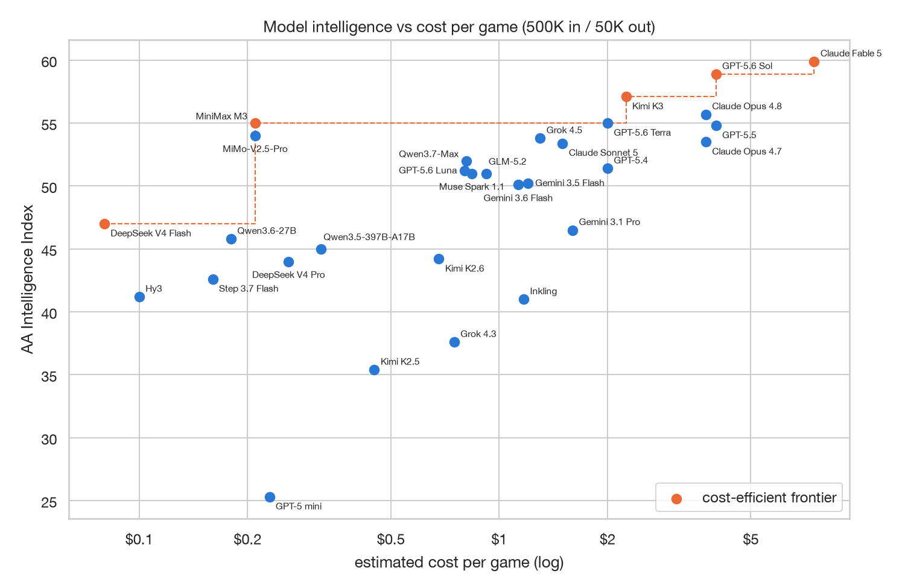
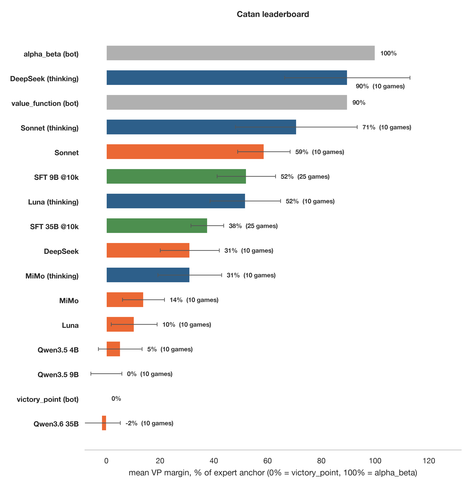
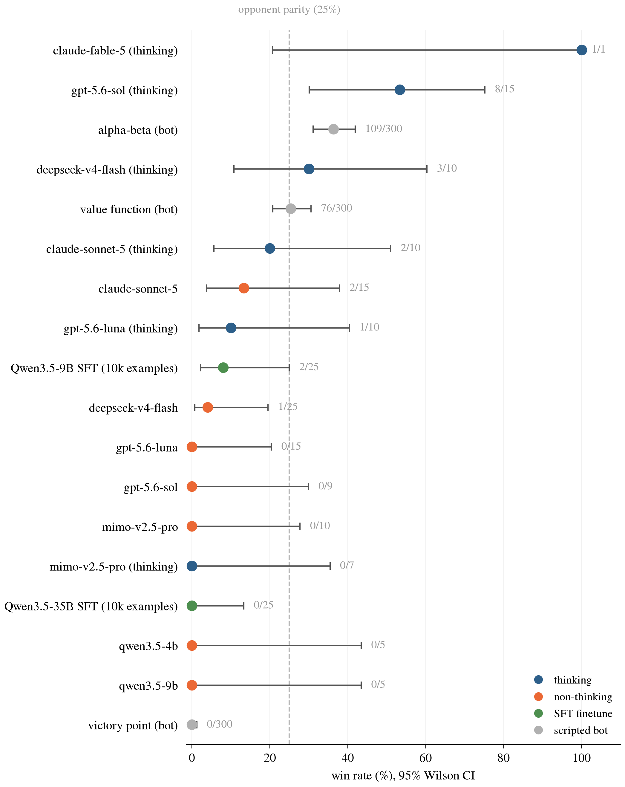
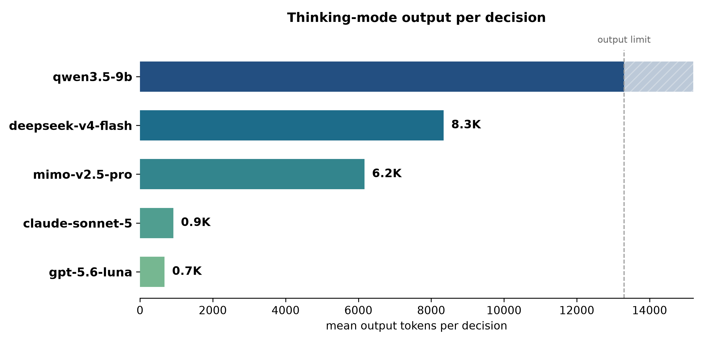
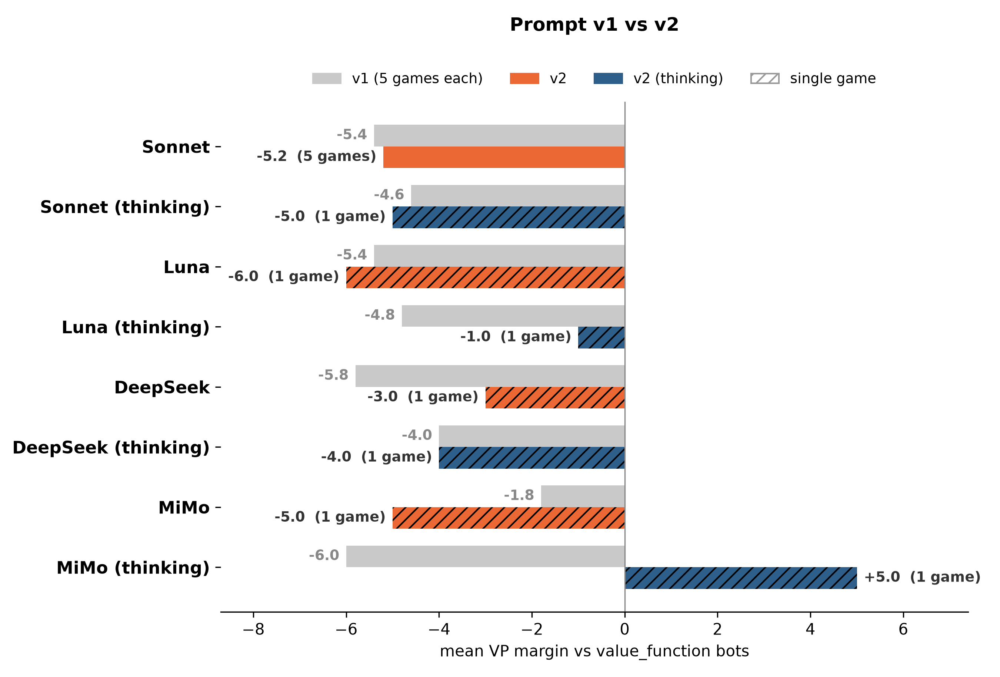
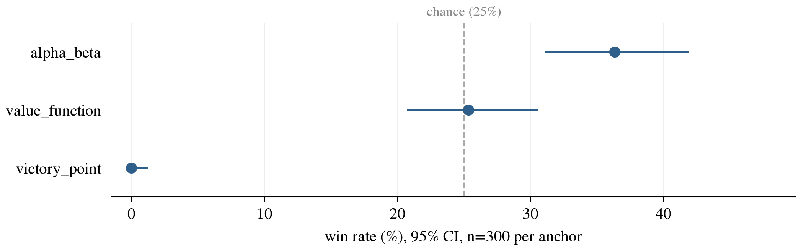
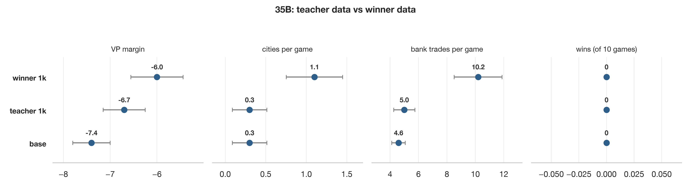
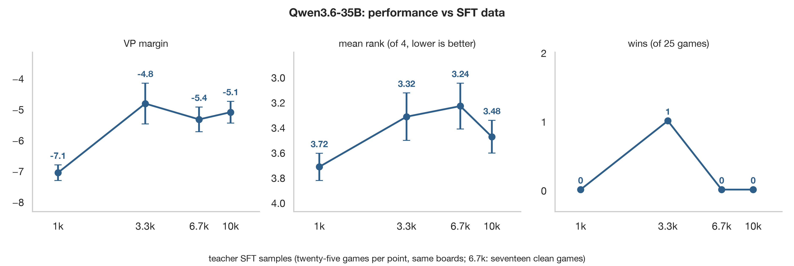
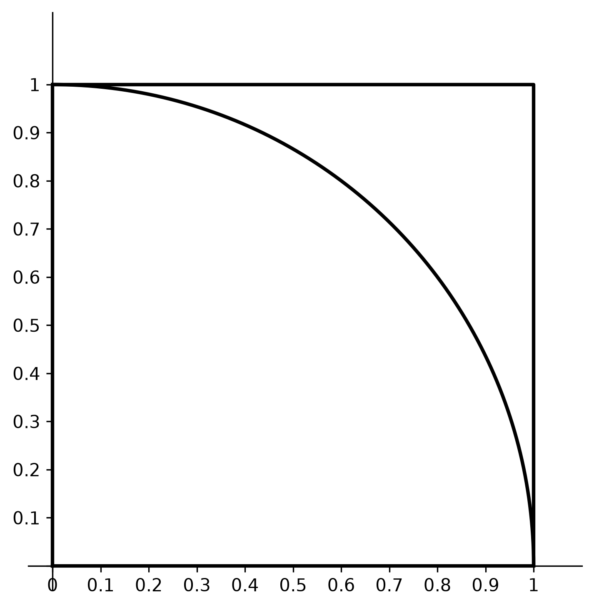

### scratchpad

- [x] install catanatron engine
- [x] trajectory design
- [x] game loop + trajectory logger
- [x] 1v1 benchmark: find best policy
- [x] serializer: engine -> LLM prompt
- [x] parser: LLM output -> engine
- [x] verifiers: environment wrapper
- [x] verifiers: define rubric
- [x] research: cost vs intelligence
- [x] study: stats
- [x] methods: estimate statistical power required
- [x] eng: fix shared seed bug in catanatron
- [ ] benchmark non-reasoning + reasoning LLMs
    - [] qwen 
        - [x] run 1 game / model
        - [x] run 5 games / model
        - [x] run 10 games / model
        - [x] run 25 games / model
    - [] non-frontier models
        - [x] run 1 game / model
        - [x] run 5 games / model
        - [] run 10 games / model
    - [] frontier models: k3, 5.6 sol, fable
        - [] run 1 game / model
- [x] sft: generate traces
- [x] sft: build dataset from logs
- [x] sft: prime script
- [ ] sft: training
    - [x] train qwen3.5-9b on 1k samples
    - [x] train qwen3.5-35b on 1k samples
    - [x] train qwen3.5-9b on 10k samples
    - [x] train qwen3.5-35b on 10k samples
    - [x] decide which qwen to finetune more
- [x] experiment: qwen3.5-9b vs qwen-3.6-35b
- [x] sft experiment: only train on winner traces
- [x] benchmark: pass rate
- [ ] is sft platueaing?
- [x] study: grpo
- [x] opd / dagger
- [ ] dpo
- [ ] rl: grpo
- [ ] look at gameplay transcripts
- [x] game replay frontend 
- [ ] experiment: 4-player mirror play

### scripted policies
Try policies in [leaderboard](https://docs.catanatron.com/advanced/making-catanatron-stronger)

### trajectory 
Schema is defined in `catan_llm/schema.py`.

### replay
Watch any logged game in catanatron's web UI.

```
python scripts/replay_to_ui.py data/eval_traces/<run>/<game>.jsonl
DATABASE_URL=sqlite:///$PWD/data/replays.sqlite flask --app catanatron.web run --port 5001
npm start --prefix ../catanatron/ui
```

Open the printed /replays link.

### serializer
Serializer translates engine to a prompt for the LLM.

This is what the model sees:
<EXAMPLE_PROMPT>

- We start with a fresh context window per decision
- The model is presented with legal moves in a numbered list
- We map the board graph into a serialized text format:
tiles: [`tile_id:resource-dice_number`, ...]

### reward 
How does the model know it's doing well? Win/lose is too sparse and delayed of a reward signal by itself. We thus introduce VP as an additional reward term...

### rubric design
`reward_win: 1.0 | 0.0` # weight 1.0
`reward_vp: min(vps, 10) / 10` # weight 0.1

We normalize the `reward_vp` term, and downweight it, so that the model doesn't learn to score games with lots of victory points, but overall loss too highly.
Not all games are equally difficult. To compare fairly, we plan to normalize relative to the performance of an *expert* Catan agent, replaying the same seat (+ deterministic seed). This is left for future work.


We also log diagnostic data with weight `0`:
`invalid_rate, truncated, game_length, decisions, rank, vp_margin`

`vp_margin` is the relative difference in VPs of our model against the best opponent vp, operationalized as `(agent_vps - max(opponent_vps)) / 10`

`truncated` games keep their reward_vp, only reward_win is 0.

We err towards logging more metrics at this point, to gain a more granular understanding of failure modes. Not all of these will make their way into the final reward.

### how well do frontier models do?
I wanted to see how good frontier models are at playing Catan. We chose to evaluate these models: 

- Qwen3.5-9B
- DeepSeek V4 Flash
- MiniMax M3
- Kimi K3
- GPT 5.6 Sol
- Claude Fable 5
- GPT 5.6 Luna
- MiMo V2.5 Pro
- Claude Sonnet 5

We hold off on Kimi K3, GPT 5.6 Sol, and Fable 5 for now. They are the most expensive by far, so we only run them once the cheaper models validate the pipeline.

Most of these sit on the cost-efficient frontier from [costs.md](costs.md). Luna, MiMo, and Sonnet 5 are near-frontier models that we decided to add to the fray: OpenAI models historically punch above their index on game-playing leaderboards, MiMo is ~tied with MiniMax M3 on cost while doing well on agentic evals, and Sonnet 5 gives us a lower-cost Anthropic comparison with strong agentic performance. Qwen3.5-9B is evaluated as we'll be using it for finetuning in later experiments.

IF GOOD: they're v good, so we use them as teacher, and obtain SFT traces from their trajectories.

IF BAD: let's see if we can do better by training a small model with SFT traces from our best performing policy.

### non-reasoning models

### cost vs intelligence 

`num_games * num_tokens * token_cost`
where
`num_tokens * token_cost = input_tokens * input_token_cost + output_tokens * output_token_cost`

For `input_tokens = 500K` and `output_tokens = 50K`, we present the estimated costs in costs.md.

We use this estimate to find the Pareto optimal models for our evaluation.



### experimental setup
We have two primary aims here:
- Is there enough statistical power to be sure our results are not just from chance?
- Do we have tight guardrails to prevent contamination/cheating?

**Statistical power**

How many games do we need to run to make sure our results are meaningful, and not just due to chance?

Let's first consider a single game of Catan.
In a game of Catan, there are two outcomes: you win ($p$) or lose ($1-p$). This can be modelled as a binomial distribution.

The mean, $E[X] = p(1) + (1-p)(0) = p$
The variance, $Var(X) = E[X^2] - (E[X])^2$ = $p-p^2$ = $p(1-p)$

Now what happens for $n$ games? Since the games are independent, we can add the variances!

If the total win count is W, then $W = X_1 + ... + X_n$.
The measured win rate is $\hat{p} = W/n$, and this is what we care about.

By the Central Limit Theorem (CLT), the sum of many independent random variables is approximately normally distributed. So, $\hat{p}$ is normal.

$Var(W) = n \cdot p(1-p)$

$Var(\hat{p}) = p(1-p)/n$

The variance is *squared*, so to end up in the same scale, we normalize by taking the square root

This is known as the "standard error",
$SE(\hat{p}) = \sqrt{p(1-p)/n}$

Now, we're comparing across models.

Let's do the pairwise case, of model $A$ and $B$. Each plays $n$ games, giving measured win rates $\hat{p}_A$ and $\hat{p}_B$.


$\hat{\Delta} = \hat{p}_A - \hat{p}_B $

The models may be playing the same game, so their variance is not independent. Hence, we have an additional covariance term

$Var(\hat{\Delta}) = \frac{p_A(1-p_A)}{n} + \frac{p_B(1-p_B)}{n} - 2 \cdot Cov(\hat{p}_A, \hat{p}_B)$

Because both models play the same initial boards and turn positions, we expect their outcomes to be positively correlated. Since covariance reduces the variance of the gap, ignoring it gives a conservative estimate of the standard error. We err on the side of running more games.

Let's also rewrite the two win rates around their average $\bar{p} = (p_A + p_B)/2$ and true gap $\Delta = p_A - p_B$:

$p_A = \bar{p} + \Delta/2, \quad p_B = \bar{p} - \Delta/2$

Substituting into the variance terms:

$p_A(1-p_A) + p_B(1-p_B) = 2\bar{p}(1-\bar{p}) - \frac{\Delta^2}{2}$

The $\Delta^2/2$ term is tiny, and dropping it again overestimates the variance. And thus, the standard error of the model gap is:

$SE(\hat{\Delta}) \approx \sqrt{\frac{2\bar{p}(1-\bar{p})}{n}}$

Let's say D_i represents the difference for the same seed $i$, but different models
$ D_i = X_{A,i}-X_{B,i} $

where
$$
D_i =
\begin{cases}
+1 & \text{only A wins,} \\
-1 & \text{only B wins,} \\
0  & \text{they get the same result.}
\end{cases}
$$

Since the difference between seeds is independent, we can say that 

$\hat{\Delta} = \frac{1}{n}\sum_{i=1}^{n}D_i$ is approximately normal

For a normal distribution, 95% of outcomes fall within 1.96 standard deviations.

So we only call a measured difference real if 

$|\hat{\Delta}| > 1.96 \cdot SE(\hat{\Delta})$

If the models are actually equal, for a single pairwise comparison, chance will fool us 5% of the time.

If the true gap between the models is exactly $1.96 \cdot SE(\hat{\Delta})$, we'll catch it 50% of the time, as our measurement is centered exactly on the threshold! Clearly, we'd want to notice this more than half the time. The standard choice of statistical power is 80%. For a normal distribution, 80% of outcomes lie above a point 0.84 SDs below the mean (check a Z-table). Therefore, if $\delta$ is the smallest gap we want to detect,

$\delta \geq (1.96 + 0.84) \cdot SE(\hat{\Delta}) = 2.80 \cdot SE(\hat{\Delta})$

Each individual game outcome, $X_{M,i}$ is Bernoulli i.e. $X_{A,i} \sim \text{Bernoulli}(p_A)$

Assuming the paired outcomes are non-negatively correlated, the variance of their difference is at most 1/4 + 1/4 = 1/2*

*($p(1-p)$ peaks at $1/4$, and the covariance term is negative)

Then, $SE(\hat{\Delta}) \leq \sqrt{\frac{1}{2n}}$

Plugging back into the earlier bound and rearranging for $n$, we get $n \geq \frac{3.92}{\delta^2}$

How sensitive do we want our measure of cross-model difference? We don't really need it to be fine. What point-difference between models do we need to establish a clear winner? Once we know that, we can decide how many games to run.

We expect strong models to do much better than weaker models. We set $\delta = 0.20$, meaning an absolute difference of 20 percentage points in win rate. We then get n=98, and round up to 100.

This is all based on relatively conservative estimates! I hypothesize that we won't need nearly this many games to get signal, at least for our initial pool of nine models. These models have non-trivial performance differences, so we expect the win rate differences to be coarse. Once we get to comparing similar tier models, it makes more sense to have high n  

TODO: note that our analysis above considered pairwise model differences, but not across the full matrix

Each model should play $n=TBD$ seeds (i.e. distinct games). Rather than replaying the same board many times, we choose to simply increase the seeded experiments. The model is "seat 0", turn order shuffles per seed. We fix the model's position across all games. We are interested in studying how models do in other turn positions in future work. The other three players are value_function bots. We report win counts. Scores remain comparable across models as they all play the same seeds. 

Note: alpha_beta is a stronger bot (36% vs 25% in our anchor runs) but ~8x slower. We thus use value_function as the opponent bots, and alpha_beta for our SFT teacher.

We ended up at n=10 for API models and n=25 for our own finetunes. This may change as we obtain more compute (you can fund us!) Then, we plan on scaling up to 5, 10, 25, 50, 100. This is yet undecided, and we will not scale up until we find that our current $n$ is inadequate for understanding relative model performance. We may only do 25 experiments for the best (most expensive) frontier models -- Fable 5 and 5.6 Sol

**Scaffolding/guardrails**
Upstream catanatron seeds *global* randomness, so concurrent games in the same process corrupt each other's dice and shuffles! We fixed this in our fork ([taziksh/catanatron](https://github.com/taziksh/catanatron), branch `per-game-rng`): each game owns its own `random.Random(seed)`.

Eval and training seeds never overlap: the eval taskset only plays seeds below 10,000, and `log_games.py` starts at 10,000. So post-training traces can never share a board with an eval game.

The model gets a fresh context window per decision. It can't carry information across decisions, or across games.

Games are only seed-deterministic under `PYTHONHASHSEED=0`, so the env refuses to run without it.

### model benchmarks

From our first set of experiments (n=5):



*Mean VP margin, scaled so 0 = victory_point and 100 = alpha_beta on the same seeds. Error bars are 95% confidence intervals.*



*Win rate vs 3 value_function bots. Error bars are 95% confidence intervals.*

Overall, the model performance more or less matches what we'd expect: bigger is better (more params), and so is longer (thinking tokens). I'm curious to see how the best models play! TODO: replay visualizer

Qwen-3.5 9B beats 4B by quite a bit (4B doesn't win a single game).

Oddly enough, 5 Sonnet does better in non-thinking mode? This trajectory needs more analysis.

MiniMax thinking is too slow (over 100 minutes per game), so we abandoned it.

Since a single game is too inconclusive, we scale up to n=5 games.

One note about the prompt: it *tells* the non-reasoning model to think! So we should control for this also.

**Sampling**

Every model runs at default recommended sampling settings. Empirically, we found that this matters more than expected. We first ran Qwen3.5-9B without setting anything explicitly; and it collapsed into regurgitating the same line. It turned out that it defaulted to vLLM's model agnostic settings at a temperature of 1.0, top_p 1.0, and no repetition penalty. The mode collapse made a lot of sense! This was resolved by setting temp=0.7, top_p=0.8, and presence_penalty=1.5, all from official guidelines.

Another important lesson: be very wary when using OpenRouter! There are frequent outages, secret quantization -- you can't trust the purported sticker names for models.
https://www.lesswrong.com/posts/KsyoSAyBRXtwzSugg/not-pinning-your-openrouter-provider-might-invalidate-your

In addition to being careful about our model's inference parameters, we also use first party platforms (Anthropic, Deepseek etc) whenever possible.

**Invalid moves**
If a model's response is invalid, we show it the board again and let it retry.
If that also fails, we play a random legal move on its behalf, and count the decision as invalid. Any full game with more than 5% of decisions that are invalid are discarded.

What fraction of  decisions are invalid?

This varies from 0-8% for the smarter API models. Qwen (small) rambles and fails to produce a valid response within its context limit,  50-70% of the time!

**Tiny thinkers**
We tried to benchmark Qwen3.5-9B, but failed. It just doesn't stop reasoning, hitting its context limit. All of its decisions timed out. We have not yet tried to increase its context limit; it *might* lead to decisions, but would be impractical as a Catan player. Our context limit is 16,384 tokens total (prompt + output combined). Why this context length? It seems to be sufficient for the larger models. Future work could investigate the abilities of Qwen3.5-9B, if allowed to think for more tokens.

The bigger thinking models: DeepSeek, Sonnet, and MiMo wrap up their reasoning in a few thousand tokens.



**Prompt**
One thing that bothers me and feels inelegant is the prompt dependence. It really does matter if I tell the non-reeasoning model to "reason briefly first", or if I include the nodes/edges in the system prompt. The really principled method here would be to do ablations at large sample sizes. But unfortunately, we have a limited budget. Also, the SFT distillation is based on prompts, so once you do some training runs, it costs even more to redo. So I chose a reasonable-seeming prompt and went with it. I'll try to be super clear about my prompt though, because I think good science requires reproducibility and overcommunicating fragility in the setup. Also, this overwhelmingly affects smaller models; larger models are too smart. I also make the claim that over enough SFT and RL, we can elicit the ceiling of model capabilities, rendering the prompt variations somewhat nil. Additionally, this comparison is over a sufficiently small game sample that the data is mostly noise. Still, including this chart below for now.

Model configurations are not consistent across providers, and are pretty easy to mess up! We learned to evaluate and check with a few sample rows for each provider to make sure we weren't getting malformed results for silly reasons. This is obvious, but can be easy to overlook if you don't carefully read all of your ai agent's codes! Oversight is crucial. As an example, we trained with an empty <think></think> pair on Tinker, since our teacher model answers immediately. But the default inference template on Tinker leaves the <think> tag open, encouraging the model to reason. We initially thought our finetuned checkpoints were completely broken (90% invalid!). But it turned out we just had to close the think tags at inference to match training.



## post-training

### sft
we start by training in perhaps the most obvious fashion possible: imitation learning.

Specifically, we do SFT on teacher traces. THe teacher is the best performing Catan policy.

we choose alpha_beta, as it was the strongest policy



**step 1: generate trajectories**

From some early experiments, each games has 50-70 decisions. We logged ~9k games for ~364k decision samples. Each of our training sets consist of whole games only; i.e. we split at the game boundaries.

```
for n in 0...num_games:
    seed = 10_000 + n
    players = [alpha_beta(RED), value_function(...)...]
    game = new Game(seed)
    while !winner and turn < max_turns:
        actor = ...
        snapshot = {
            board, hands (all 4 players), bank, legal_actions, chosen_index
        }
        records.append(snapshot)
        game.execute(action)

    write file: data/games/<lineup>_s<seed>.jsonl
        line 1: game summary (seats, layout, winner, final VPs, etc)
        lines 2..N: decision snapshots
```

**step 2: create dataset**
this is relatively straightforward, we use the schema from before

**step 3: train** 

Loss is computed only on the assistant's final answer tokens. The game state is masked out. The intent is for models to compute the final answer; we don't care for it to learn the board state per se.

We hold out ~10% of the gameplay trajectories as our validation set. Validation set is never from the same game as training, as there is significant overlap in decisions.

To evaluate checkpoints, we have two metrics:

1) Val loss as a quick first check
2) Compare model performance on the same game seed to base model

To determine the optimal # of training samples, we train on first 1k, then 10k, then 100k samples. 

We initially tried to use Prime Intellect's on-demand GPUs, but after a night of endless A100/H100 crashes, switched to Tinker.

We use Tinker's recommended settings: rank-32 LoRA, learning_rate 2e-4, and batch 128. We use the instruct/hybrid model, rather than the base/pre-trained.

We do a comparison of the dense 9B vs the 35B mixture of experts with 3B active parameters.

We trained both 9B and 35B models on ~1k training samples. They both go from making ~50% or more invalid moves, to 0%. Their relative VP also goes up. The models have still not won a single game (n=5).

Things get more interesting at 10k training sample regime. 9B and 35B both win a game (n=10). Their relative average rank and VP margin also improves. But 10 games is too small a sample to pick a winner! We think before investing more compute and time into training on more samples on *both*, it's more worth it to bench them on a LOT of games, and pick the winner.

We also compute the teacher agreement for both models. Specifically, we replay the game, note what our candidate finetuned model does, and compare it to what the teacher (alpha_beta) would do. The final score is a tally of the ratio.

They both obtained a similar score on the decisions -- 9B, 61.7% +-1.4, 35B, 61.9% +- 1.4. They're really close!

**FIGHT CLUB**
Next, I pitted the models against each other. Specifically, we had the two models play the same 4p games, fixing 2 seats with `value_function` bots. We varied the seat order to control for its impact.

This time, 9B ranked higher in 12 games, 35B in 13, and they tied in one. It's worth noting that in absolute terms, 35B is the clear winner here -- with 6 actual wins vs 9B's single.

Because of the fewer active params, 35B also trains cheaper! So we got with Qwen-3.6-35B-A3B for our remaining finetuning runs.

**qualitative analysis**

**winners only**
initially, we did SFT naively: train on ALL games played by our winning bot. but we realized this was silly: we could generate unbounded games, this means we can be picky with which data we train on! Why not just train on winning games? We applied as a form of rejection sampling. Apparently, this is similar to rejection-sampled SFT. 

secondly, we also realized that pitting our best bot against three less intelligent bots might not be the best way to elicit the best strategies. so, we instead recast it as 1v1v1v1, with the smartest bots. then, we cast the winning player as the "hero", and use that for our training data.

to test this out, we compared training on "winner" to the prior method.



The winner model has the same wins, but trades more, builds more cities, and has a marginally better relative VP. Keep in mind that these are only on n  = 10 games! This is minor but some evidence to take winner trajectories. I hypothesize it's a reasonable choice so I'll do it. 

before going out and training, i also realized i should step back and do a more thorough and extensive evaluation of our trajectory generation process.

d3, d2, d2_contender, same_turn, d4 all do similarly!

we drop d4 bc its combinatorially expensive w no clear benefits.

greedy_playouts is too slow

d2_contender tried diff coefficients for d2, but performed similarly.

d3 is also an OOM slower than d2, so we dont want it to generate data

final matchup:d2, d3, d2_contender, same_turn

also, mirror to model what happens when modeks plkay rthemselves. ryn wutg both d2 and same_tyrn

**limits of sft**
we finetuned the model to output *just* the decision. SFT of this sort teaches the student the expected format, but doesn't give it good intuition for why decisions were made. 

this suggests we need to give the student more context somehow.

some ideas:
- train it with reasoning traces
- train it with reinforcement learning with reward signals, so it learns correct moves, and not just the final ....? hang on, does it learn the decision per turn? TODO, ask LM

there is some preliminary evidence that SFT plateaus after training on just 3.3k samples, which is about 50 games (check exact number). val/loss keeps going down, but the model doesn't improve at the game. this is true as assessed by both overall wins, and auxiliary stats (how many VP points it earns, and its overall rank). Note how 1k -> 3.3k is a noticeable jump, but it sort of plateaus after.



We must now decide: 
- Do we adjust our SFT training setup? OR
- Do we post-train, with perhaps GRPO?

Rn our output format is quite brittle, and might be constraining what the model learns during fine tuning. Concretely, the model sees responses of the form "answer: 3".

The model might be learning to predict numbers without attending to the relevant move. To prevent this from happening, it might be worth adding natural language information *about* the move. e.g. "answer: 3. buy house."

Additionally, to prevent the model from overfitting to the position/index, we can shuffle the numbers. I'm not sure what the net effect on this would be, since I can also see shuffling, esp for smaller models, leading to more confusion. Perhaps this needs to be resolved empirically.

### grpo

**monte carlo estimates**

Here's a fun fact:

If you start with a unit square (so, area 1^2 = 1), and an inscribed circle quadrant, (its radius equals square's edge, so area pi*1^2/4 = pi/4), you can estimate the value of pi! How?



1) Scatter a BUNCH of random numbers *uniformly* within the square
2) Count the points INSIDE the quadrant
3) The ratio of the points inside the quadrant, to those in the overall square, will give you an increasingly accurate estimate of pi/4

This is known as monte carlo estimation and is a useful math technique. I recommend the Wikipedia article for more:

https://en.wikipedia.org/wiki/Monte_Carlo_method#Overview

TODO: link to gif here too

This is a pretty core component of how Group Relative Policy Optimization (GRPO) works. 

GRPO samples multiple outputs from our *current model*, and treats the average reward of these as a baseline. Later, any result that is greater than this average is a positive "advantage", and anything below is a negative "advantange".

$$A_i = \frac{r_i - \text{mean}(\{r_1, r_2, \cdots, r_G\})}{\text{std}(\{r_1, r_2, \cdots, r_G\})}$$


The advantange is defined as $ A^\pi(s, a) = Q^\pi(s, a) - V^\pi(s). $

In words, it's the difference between taking a particular action in the current state (note the args for both state, `s`, and action, `a`), and how the current policy does on average from that state, $V$ (which takes just `s` as a parameter).

I might do more RL definitions later but I highly recommend https://spinningup.openai.com/en/latest/spinningup/rl_intro.html if you're new to this.

There are a few other tricks to GRPO, namely:
- clipping, 
- KL divergence to the reference model

These are good sources to learn more about GRPO:
- https://cameronrwolfe.substack.com/p/grpo-tricks
- https://huggingface.co/blog/NormalUhr/grpo

We don't want the boards to be so hard that the model never wins. In that extreme (but not unlikely) case, every reward is the same, so the advantage is just 0! Going back to the GRPO advantage formula, GRPO learns nothing.

So we want to find how often our model even wins at Catan.

We can get a sense of how "difficult" a board is for the model by calculating it's pass rate. Given $k$ attempts at the same board, what fraction of the games does the model win? We're interesting in seeing that over enough samples, the model is capable of winning. Notably, it doesn't have to win every game. TODO: something something RL


To evaluate the pass rate, we do 8 rollouts over 8 distinct game boards, for a total of 64games. We use our 9B model finetuned on 10K samples. The sampling temperature is 1.0, to match what the RL trainer will use during its rollouts. This just means the model uses the probabilities learned during training.


### costs

i already had $5-10 of credits on oai and openrouter. i won't include those until i find my receipts.

here are the other credits i had to pay for:

givemeanode | $500
tinker | $ 150
prime intellect | $30 
anthropic | $30
openrouter | check usage dates+amt
xiaomi | $4
openai | check usage dates+amt

will update once i see if these are all used

### future work
- teach it to trade
- do reasoning traces help?
- train on curriculum: general games, then winner only

### references:
- https://docs.primeintellect.ai/verifiers/v1/overview
- https://djdumpling.github.io/2025/11/24/rl_envs.html
